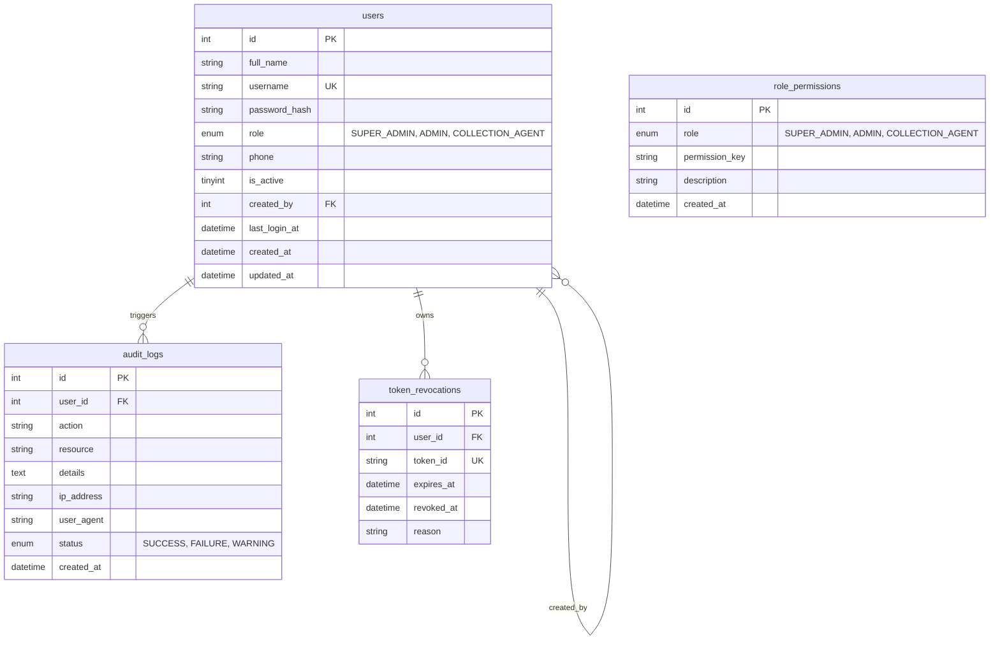
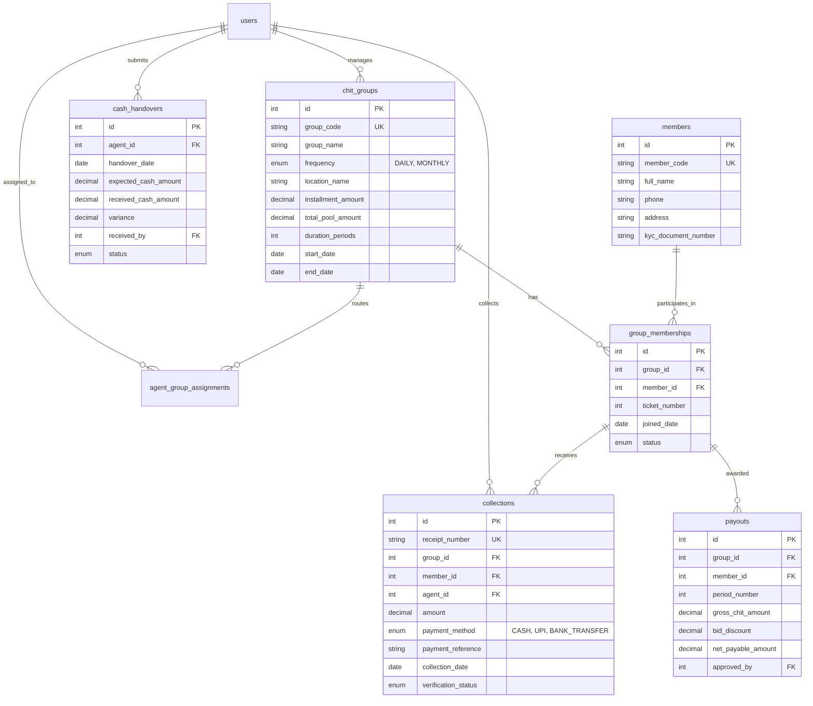

# Chit Fund Management System — Entity Relationship (ER) Diagrams

## Milestone 1: Authentication & Authorization Schema (Active)

```mermaid
erDiagram
    users ||--o{ audit_logs : "triggers"
    users ||--o{ token_revocations : "owns"
    users ||--o{ users : "created_by"
    
    users {
        int id PK
        string full_name
        string username UK
        string password_hash
        enum role "SUPER_ADMIN, ADMIN, COLLECTION_AGENT"
        string phone
        tinyint is_active
        int created_by FK
        datetime last_login_at
        datetime created_at
        datetime updated_at
    }

    role_permissions {
        int id PK
        enum role "SUPER_ADMIN, ADMIN, COLLECTION_AGENT"
        string permission_key
        string description
        datetime created_at
    }

    token_revocations {
        int id PK
        int user_id FK
        string token_id UK
        datetime expires_at
        datetime revoked_at
        string reason
    }

    audit_logs {
        int id PK
        int user_id FK
        string action
        string resource
        text details
        string ip_address
        string user_agent
        enum status "SUCCESS, FAILURE, WARNING"
        datetime created_at
    }
```

---

## Complete Business Architecture Preview (Milestones 2+)

```mermaid
erDiagram
    users ||--o{ chit_groups : "manages"
    users ||--o{ agent_group_assignments : "assigned_to"
    users ||--o{ collections : "collects"
    users ||--o{ cash_handovers : "submits"
    
    chit_groups ||--o{ group_memberships : "has"
    members ||--o{ group_memberships : "participates_in"
    chit_groups ||--o{ agent_group_assignments : "routes"
    
    group_memberships ||--o{ collections : "receives"
    group_memberships ||--o{ payouts : "awarded"

    chit_groups {
        int id PK
        string group_code UK
        string group_name
        enum frequency "DAILY, MONTHLY"
        string location_name
        decimal installment_amount
        decimal total_pool_amount
        int duration_periods
        date start_date
        date end_date
    }

    members {
        int id PK
        string member_code UK
        string full_name
        string phone
        string address
        string kyc_document_number
    }

    group_memberships {
        int id PK
        int group_id FK
        int member_id FK
        int ticket_number
        date joined_date
        enum status
    }

    collections {
        int id PK
        string receipt_number UK
        int group_id FK
        int member_id FK
        int agent_id FK
        decimal amount
        enum payment_method "CASH, UPI, BANK_TRANSFER"
        string payment_reference
        date collection_date
        enum verification_status
    }

    cash_handovers {
        int id PK
        int agent_id FK
        date handover_date
        decimal expected_cash_amount
        decimal received_cash_amount
        decimal variance
        int received_by FK
        enum status
    }

    payouts {
        int id PK
        int group_id FK
        int member_id FK
        int period_number
        decimal gross_chit_amount
        decimal bid_discount
        decimal net_payable_amount
        int approved_by FK
    }
```
